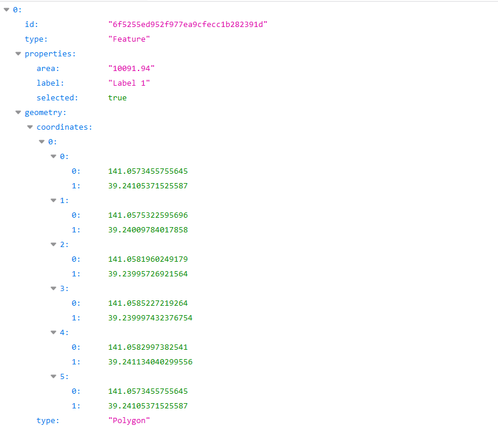
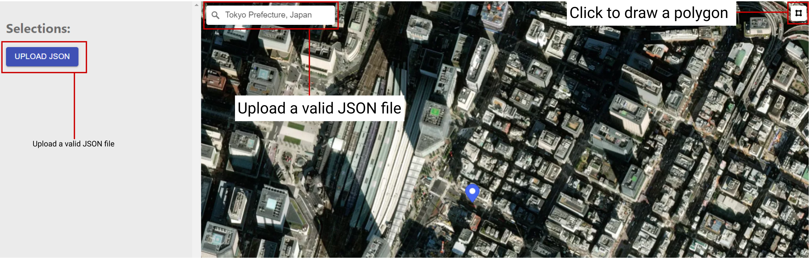
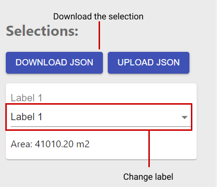
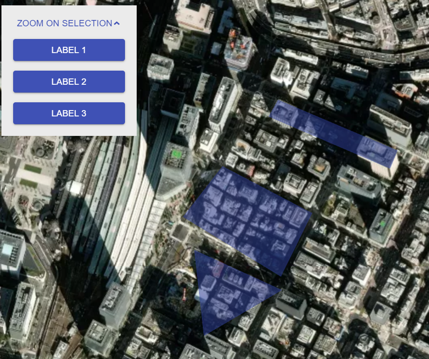
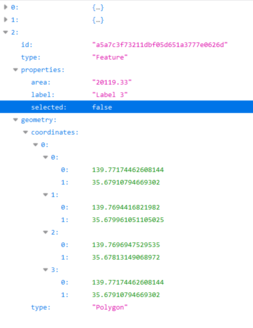

# MAP DATA SELECTION TOOL

This tool allows the user to select areas on a map and then create and download a JSON file with the geo data regarding that same selection.
The user can also upload a JSON file and provided it has the right data format (GEOJSON), it will display all the selections contained in the file on the map.

An example of a valid JSON file to be uploaded would be as follows:

For the scope of this project the map view is restricted to the Japan island so any location searched outside of this scope will not appear on the map.

This tool was built using React.js for it's state handling capabilities allowing the creation of various map selections without refreshing the page each time one is created, MaterialUI for it's 'out of the box' built in components making the time spent building UI components, i.e buttons and containers, much shorter and Mapbox for it's capabilities of rendering maps and subsequent tools in a React application context.

## HOW TO NAVIGATE THE FILE STRUCTURE:
Inside the `src` folder, the files of interest are contained in the `store` folder and the `components` folder.

### STORE FOLDER:
In this project I am using Redux to handle the **components state**.

The `action_types.js` file contains the **action types** used to define what **action** will be be passed to the **reducers**.

The `index.js` file is used to create the store which will handle the components state.

The `actions` folder contains the **actions** passed to the **reducers**.
These include:
- the `addFeatureAction` used to create a selection and to store it's data;
- the `removeFeatureAction` used to remove and clear the selection's data.

The `reducers` folder contains the **reducers** that handle the **actions**.
These include:
- the `rootReducer` which combines all the reducers into one single reducer to be used across th application scope.
- the `featureReducer` which handles all the features actions (creation and deletion).

**NOTE: the selection deletion feature is not implemented yet and will be done in the near future.**

### COMPONENTS FOLDER:
The `components` folder contains all the components used to build the application:

- The `LeftMenu` folder contains the files that manage the downloading and uploading of the **JSON files** as well as the labeling and the information about the selection.
- The `MainWrapper` folder contains the wrapping for both the **left side menu** and the **map interface**.
- The `MapTool` folder contains the files that handle the map UI, meaning the draw tool, the search bar, the zoom on selection dropdown, the search bar and the map itself.

## HOW TO USE THE MAP TOOL:
1. Upload a JSON file or search for a location on the search bar and start drawing a polygon on the map to see any changes.

    

2. After a polygon is created you can either change it's label or download it.

    

3. To zoom on a previously created polygon use the "ZOOM ON SELECTION" dropdown and click on the labels to zoom in.
 
    

4. Download the file to get an array of geojson objects for posterior use.

    

